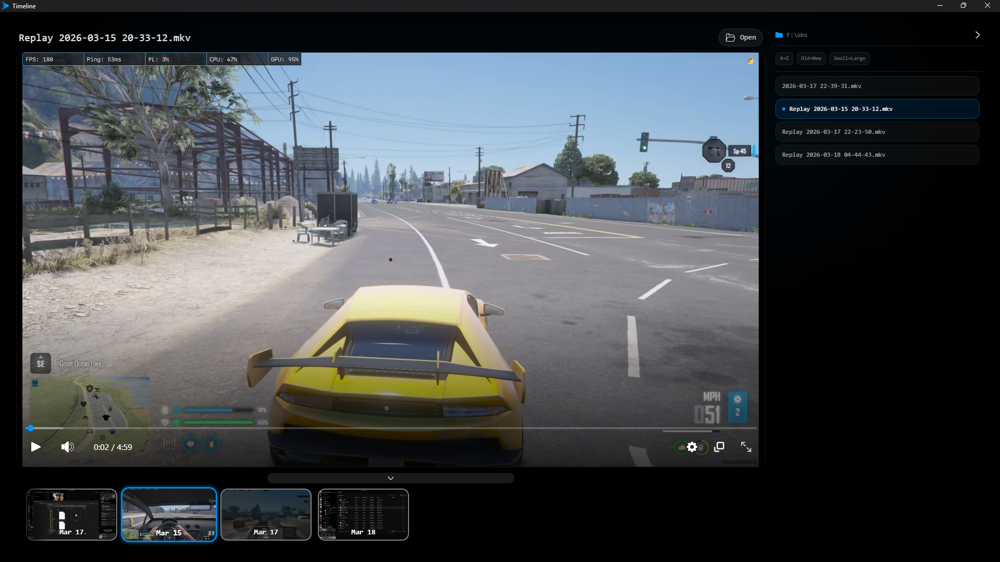

<p align="center">
  
</p>
<h1 align="center">Timeline</h1>
<p align="center">
A fast, simple, and modern media player built for everyday use.
</p>

## 🚀 Features

- ⚡ **Fast** – opens files instantly  
- 🔄 **Auto updates** – always up to date  
- 🎯 **Simple UI** – easy to use, no clutter  
- ⌨️ **Custom hotkeys** – control your way  
- ✂️ **Trimming** – quick editing built-in  
- 🆓 **Free** – no cost, no paywalls
-   
## 🎞️ Supported Media Types
```json
['.mp4', '.webm', '.mkv', '.avi', '.mov']
['.mp3','.wav','.ogg','.aac','.m4a','.flac','.opus','.weba']
```

## 📸 Preview


## 🖥️ Platform

Currently supported:
- Windows 10  
- Windows 11  

*(Support for other platforms may come later)*

---

## 🔒 Privacy

Timeline does **not collect personal data**.

The app only collects minimal analytics to improve performance:
- IP address  
- Device/software info  
- App usage events  
- Media metadata (duration, file type)
- Errors

No personal files or sensitive data are accessed or stored.

---

## 📦 Download

Download the latest version from the **Releases** section.

---

## 💡 Why Timeline?

Most media players are slow, outdated, bloated, or just hard to use.
I felt the same, so I built Timeline — and now I’m sharing it with you.

Timeline focuses on:
- speed  
- simplicity  
- clean experience  

---

## 🛠️ Status

Actively being developed and improved.

---

## ❤️ Feedback

If you like it or have suggestions, feel free to email me at sukritthakur821@gmail.com
